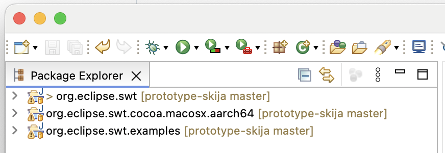
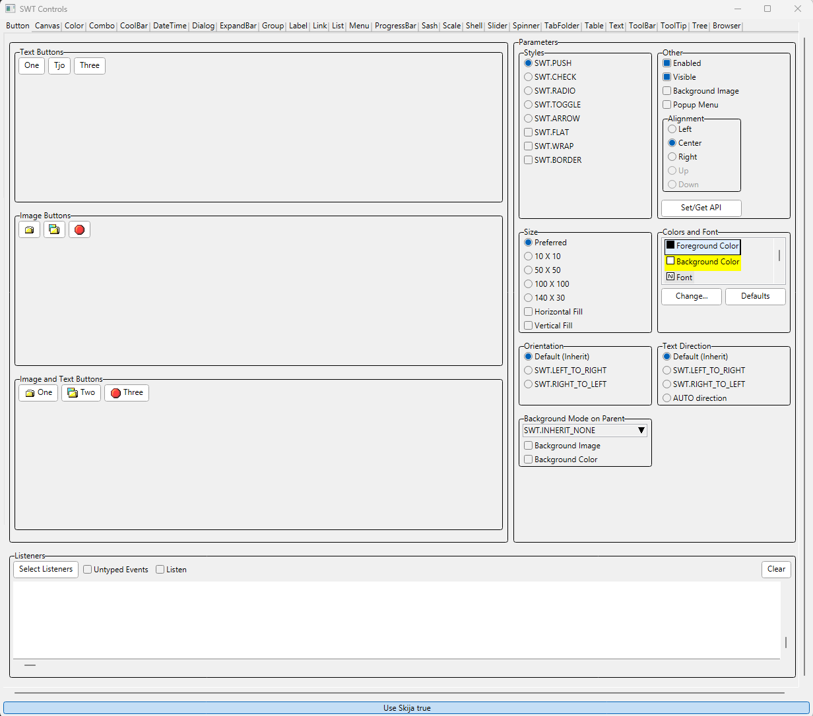
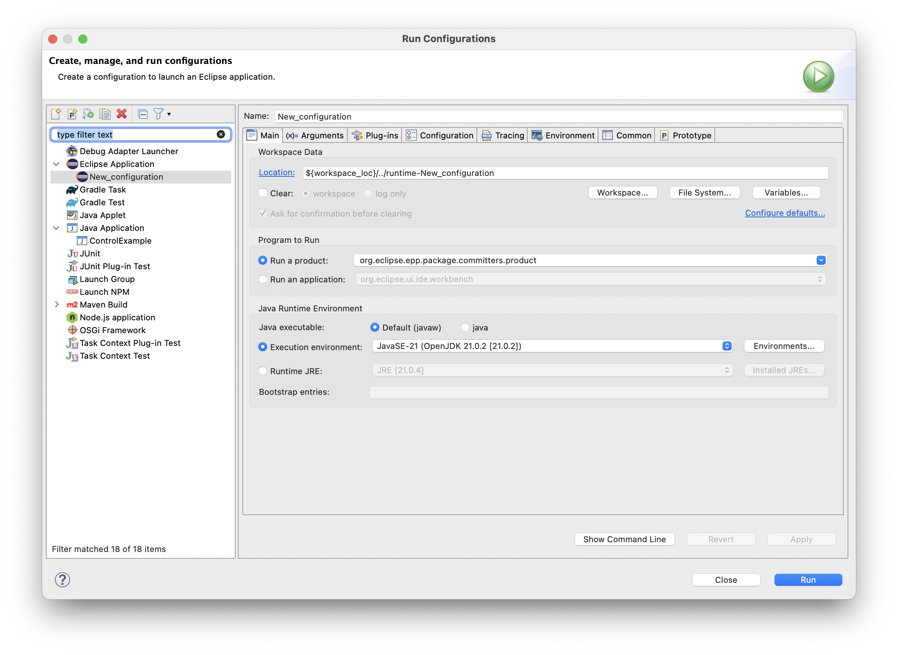

# SWT on Custom-Rendered Widgets With Ski(j)a

This repository is a fork of the original [SWT repository](https://github.com/eclipse-platform/eclipse.platform.swt) containing prototyping work on exchanging the adaptation of native, basic widgets with custom-drawn widgets based on the rendering engine Skia and its Java bindings [Skija](https://github.com/JetBrains/skija).

In the following, you find information about the current state of the prototype and how to try it out. Note that the prototype does currently not provide other/better look and feel or customizability compared to the native widgets. It is supposed to demonstrate feasibility to custom draw widgets based on an efficient rendering engine (as an enabler for improved customizability and look and feel) while seamlessly integrating the custom-drawn widgets with the other, still native widgets. For that reason, the custom-drawn widgets are currently implemented to look similar to the existing widgets they replace, but they could be easily replaced with whatever look and feel is desired.

## Getting Started

To test the prototype, an Eclipse IDE has to be set up and the SWT projects from this repository have to be imported into it to start example applications.

Note that the current development does not target all platforms (Windows, MacOS, Linux). Development usually happens on Windows (and partly MacOS), so the experience will be best there. No implementation and testing for Linux has been performed so far.

### Setup

1. Set up a recent Eclipse IDE for Committers (currently 2024-09 or newer including nightly builds), e.g.:
   - [Eclipse IDE for Committers 2024-09](https://www.eclipse.org/downloads/packages/release/2024-09/r/eclipse-ide-eclipse-committers)
   - [Eclipse SDK Development Environment](https://github.com/eclipse-platform/eclipse.platform?tab=readme-ov-file#how-to-contribute)
2. Clone this repository
3. Start the downloaded IDE and import the following projects:
   - The SWT bundle `org.eclipse.swt`
   - The OS-specific fragment `org.eclipse.swt.$WS.$OS.$ARCH` with the placeholders according to your environment, such as `org.eclipse.swt.win32.win32.x86_64` for the Windows fragment
   - _Optional:_ For testing purposes `org.eclipse.swt.examples`

The resulting workspace should look something like this:

### Examples

Starting with this, you can try out the SWT implementation with whatever application you want by also importing the according plug-ins into your workspace. Two reasonable, simple starting points are (1) the SWT `ControlExample`, a demo application containing all basic SWT widgets with configurability for most of their functionality, to see how the widgets look like and behave, and (2) a simple Eclipse application to see how it looks in a complete application.

#### `ControlExample`

The `ControlExample` is part of the example project. It is placed in `org.eclipse.swt.examples.controlexample`. You can run this class as a Java application. The application has tabs for the individual widgets. The tab that opens first is for the `Button`, which is completely custom-drawn. So almost everything you see on that page is custom-drawn via code of the prototype.

At the bottom of the application, a toggle button allows to switch between using the native and the Skija-based renderer ( `GC`) at runtime (see [State](#state)). You can currently distinguish the two rendering engines by looking at the edges of buttons, which are currently not rounded when using the Skija-based GC. The following screenshot shows the rendering of that page based on Skija.

#### Eclipse Application

To start a simple Eclipse application, create a `Run Configuration` via the menu `Run`, menu item `Run Configuration` and in the dialog opening up by double-clicking on the `Eclipse Application` type to create a new configuration that you can launch via the `Run` button:

The Eclipse application that starts will automatically use the custom-drawn widgets. To see a page with mostly custom-drawn widgets, you can, for example, open the `Create Java Project` wizard:

## State

Note that this is work-in-progress prototyping work. The implementation is not (supposed to be) production ready.
Currently, there are (at least partial) custom implementations for the following basic widgets:
- Button
- Label
- Text
- Combo

For information about contributing to Eclipse Platform in general, see the general [CONTRIBUTING](https://github.com/eclipse-platform/.github/blob/main/CONTRIBUTING.md) page.

## Developer Resources

See the following description for how to contribute a feature or a bug fix to SWT.

- <https://www.eclipse.org/swt/fixbugs.php>

Information regarding source code management, builds, coding standards, and more and be found under the following link.

- <https://projects.eclipse.org/projects/eclipse.platform.swt/developer>

Also see in the SWT section of the Eclipse FAQ for more background information about SWT.

- <https://github.com/eclipse-platform/eclipse.platform/blob/master/docs/FAQ/The_Official_Eclipse_FAQs.md#standard-widget-toolkit-swt>

## Contributor License Agreement

Before your contribution can be accepted by the project, you need to create and electronically sign the Eclipse Foundation Contributor License Agreement (CLA).

- <http://www.eclipse.org/legal/CLA.php>

## Contact

Contact the project developers via the project's "dev" list.

- <https://accounts.eclipse.org/mailing-list/platform-dev>

## Search for Bugs

SWT used to track ongoing development and issues in Bugzilla .

- <https://bugs.eclipse.org/bugs/buglist.cgi?product=Platform&component=SWT>

## Create a New Bug

You can register bugs and feature requests in the GitHub Issue Tracker. Remember that contributions are always welcome!
- [View existing SWT issues](https://github.com/eclipse-platform/eclipse.platform.swt/issues)
- [New SWT issue](https://github.com/eclipse-platform/eclipse.platform.swt/issues/new)

Please bear in mind that this project is almost entirely developed by volunteers. If you do not provide the implementation yourself (or pay someone to do it for you), the bug might never get fixed. If it is a serious bug, other people than you might care enough to provide a fix.

# Prototyping on a Single, Cross-Platform SWT Implementation

There is current work on evaluating the feasibility of achieving a single, OS-agnostic implementation of SWT in order to reduce maintenance efforts, enable better look and feel, and improve configurability.
The work on these prototypes and their documentation can currently be found in a dedicated GitHub organization: https://github.com/swt-initiative31

Actual prototyping work has been started on four technologies: Skia with Visual Class Library (VCL), Skia with custom-rendered widgets, GTK, and Swing\
The prototypes for the following technologies are still under investigation, are further developed and can be tried out here:
- Skia with custom-drawn widgets: https://github.com/swt-initiative31/prototype-skija
- Cross-platform GTK: https://github.com/swt-initiative31/prototype-gtk
